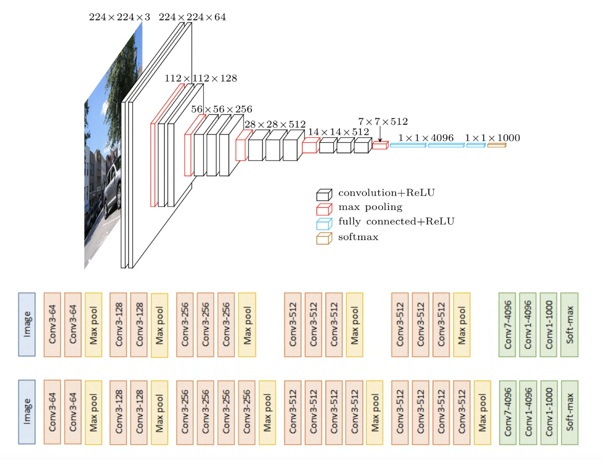

## Q1. 

When using H.264 for compression, one image block difference is  

\[
A = \begin{bmatrix}
0 & 0 & 20 & 20 \\
0 & 0 & 20 & 20 \\
0 & 0 & 20 & 20 \\
0 & 0 & 20 & 20
\end{bmatrix}
\]

The integer transform matrix is  

\[
H = \begin{bmatrix}
1 & 1 & 1 & 1 \\
2 & 1 & -1 & -2 \\
1 & -1 & -1 & 1 \\
1 & -2 & 2 & -1
\end{bmatrix}
\]

Compute the integer transform consequence.
## Q2. 

**(a)** Get the number of trainable parameters (weights) for the third convolution+ReLU layer. Bias added in the convolution layer.
**(b)** Find the number of classes classified foe this CNN model.

## Q3.
**(a)** The minimal pixel distance when H.264 motion compensation computation (e.g 1-pixel, 1/2-pixel).

Followings are three MQs, I cannot remind all choices, give the corresponding domain here:

**(b)** MPEG-1 and MPEG-2

**(c)** RNN and LSTM

**(d)** CNN Softmax